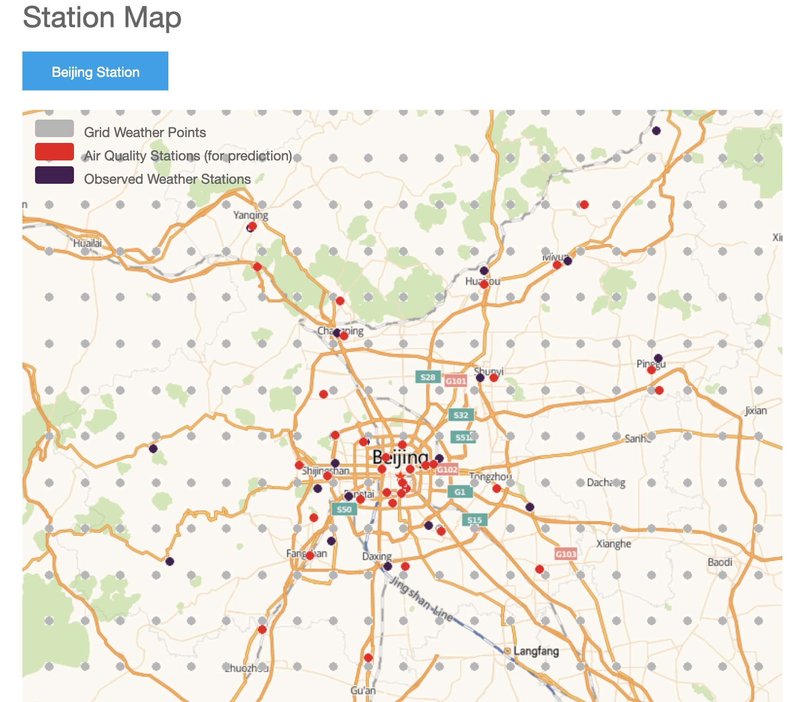
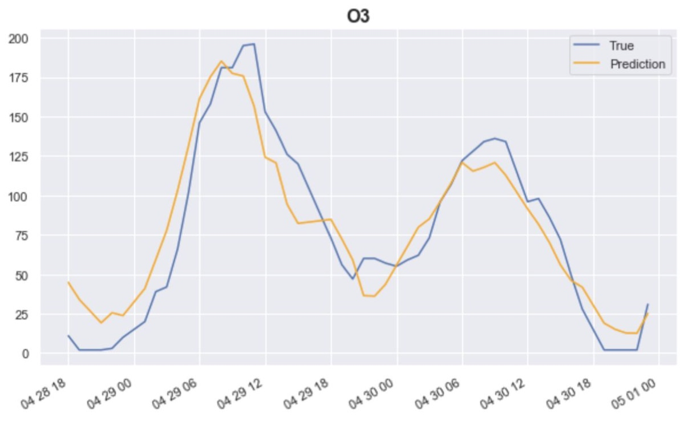

# AirQualityPrediction

## Project Introduction
### 1. Introduction
This project has applied some Machine Learning techniques to analyse and predict the Air Quality in Beijing. I mainly use the **XGBoost** and **LSTM** model to predict concentration levels of several pollutants **(PM2.5, PM10, O3)** over the coming 24*2 hours (two days) for **35** stations in Beijing, China.

### 2. Data
The air quality data and meteorological(weather) data from January 2017 to April 30 (including), 2018 are provided in the file named **'MSBD5002PROJECT_data.zip'**.

### 3. Task
The final task is to predict the pollution level of PM2.5, PM10, O3 between May 1 to May 2, 2018 (once an hour, 48 times for one station in total).

### 4. Overview of the stations distribution

### 5. Souce Code
The main project implementation files can be seen in the directory named **'src'**. The structure and description of this directory is shown as:
- src:
    - DataPreprocessing.ipynb
        - The notebook mainly for data cleaning and data preprocessing
    - LSTM.ipynb
        - The notebook which applied LSTM model for prediction
    - XGBoost.ipynb
        - The notebook which applied XGBoost model for prediction
    - evaluation.py
        - The Python file which implements the SMAPE(Symmetric Mean Absolute Percentage Error) evaluation function.
            
            

### 6. Final Report
The **'report.pdf'** file includes details of the data preprocessing process and the final prediction result. The following image shows the prediction value and true value of O3. If you want to figure out more details, please refer to the report.

            